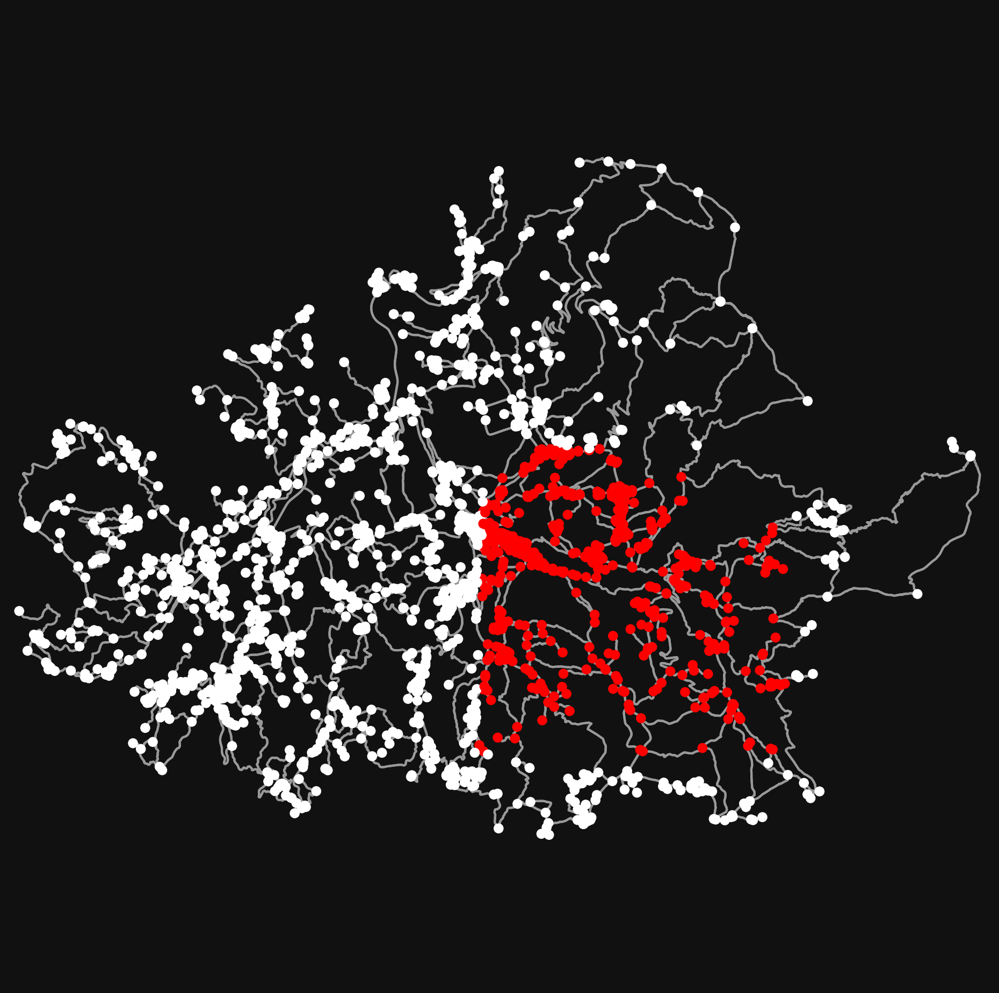

# MEUS: Management of Emergencies through Ubiquitous Sensing
This project in Python 3 allows to simulate the behaviour of people moving between the nodes of a graph imported from OpenStreetMap.
Each node contains the information about how many people are in that node, and which kind of connection is available.

## How to create a virtual env containing OpenStreetMap and install dependencies

Download zip or git clone this repository to your machine:
```bash
git clone https://github.com/lucregrassi/MEUS.git
```
If you do not have already Anaconda or MiniConda installed on your machine install MiniConda: https://docs.conda.io/en/latest/miniconda.html.
Create a virtual environment with a name of your choice:

``` bash
conda config --prepend channels conda-forge
conda create -n <name-of-your-env> --strict-channel-priority osmnx
conda activate <name-of-your-env>
```
To install dependencies:
```bash
cd <path-to-this-repo>
pip install -r requirements.txt
```

## Launch local server and set up database
run the commands
```bash
cd src/
python main_database3.py
```
copy the base address which will show up in the terminal upon launching the script.
Open a python shell and type:
```python3
>> from main_database3 import db
>> db.create_all()
```
This command has generated the database file where to store the data from the simulation.

## Start the simulation
To change the simulation parameters type the -h flag to get help and change parameters.
```bash
$ python main.py -h
```
You can set the number of people moving in the graph, the number of iterations, and the distance traveled by each person in each loop.
To run the simulation with default parameters, open the terminal and type:
```bash
python main.py
```
<p align='center'>
    
</p>
The image above is the graph representation of the italian town of Amatrice wherein agents explore the environment and if they happen to be in the same node and having compatible devices they are able to exchange relevant information previously gathered. The red dots are nodes in which a global network connection is available (necessary to send data to the remote database).

## Database structure
The database has 2 main tables:
1) Direct observation tab: 
```python3
class dirObsTab(db.Model):
    id              = db.Column(db.Integer, primary_key=True)                             # Integer uniquely identifying the entry in the db
    situation       = db.Column(db.String(50), nullable=False)                            # situation "field" of an event
    obj             = db.Column(db.String(50), nullable=False)                            # object "field" of an event
    when            = db.Column(db.Integer, nullable=False)                               # loop at which the event=(situation, object) has ben observed
    where           = db.Column(db.Integer, nullable=False)                               # node wherein the observation has occurred
    who             = db.Column(db.Integer, nullable=False)                               # agent who has made the observation
    info_histories  = db.relationship('infoHistoryTab', backref="dir_obs_tab", lazy=True) # relation with the history_tab
```
2) Info history tab:
```python3
class infoHistoryTab(db.Model):
    id              = db.Column(db.Integer, primary_key=True)                 # Integer uniquely identifying the entry in the db
    dir_obs_id      = db.Column(db.Integer, db.ForeignKey("dir_obs_tab.id"))  # integer saying to which observation this jump is belonging to
    observer        = db.Column(db.Integer, nullable=False)                   # who has made the observation (= to the who field of the dir_obs_tab)
    a1              = db.Column(db.Integer, nullable=False)                   # agent communicating the info
    a2              = db.Column(db.Integer, nullable=False)                   # agent the receiving the info
    sender          = db.Column(db.Integer, nullable=False)                   # agent who has sent the info to the db (It has to be a gateway agent)
    where           = db.Column(db.Integer, nullable=False)                   # node wherein the communication has taken place
    when            = db.Column(db.Integer, nullable=False)                   # loop at which the communication has taken place
    sent_at_loop    = db.Column(db.Integer, nullable=False)                   # loop at which the info has been sent to the db
    sent_where      = db.Column(db.Integer, nullable=False)                   # node in which the info has been sent to the db
```

Each field in each class corresponds to a column in the respective db tab. This structure allows to have the possibility, given the unique direct observation, to track how this information has traveled among agent's iEs prior to being stores in the db.
It has to be noticed that whenever the simulation is interrupted before its completion the database has to be cleared as well. To do so:
open a python shell and run the following command:
```python3
>> import requests
>> requests.delete(<base_address> + 'IE/1')
```

## Output Data
In the main_database3.py file (the server) there is the possibility to set the out path where to set the results obtained from the simulation concerning the decisions of the agents.
The files have a name which is the id of the a specific node. Each file is a csv file in which the fields are the following:
- Ncoders:      number of voters for this event
- who:          the specific agent's id
- when:         time loop when the observation has happened
- what:         index of the reported observation
- observations: list of the observations made so far
- ground truth: the actual event present in this node
- distance:     semantic distance from the ground truth (0, 1 or 2)
- CVR:          Content Validity ratio metric (0 or 1); -2 means it cannot be applied
- Kalpha:       Krippendorff's alpha metric, ranges between -1 (total disagreement) and 1 (complete agreement)

Every row in the file represent a new observation being reported for that event in that node.

## Authors
| Name | E-mail |
|------|--------|
| Lucrezia Grassi| lucrezia.grassi@edu.unige.it |
| Mario Ciranni | mario.ciranni@gmail.com |
